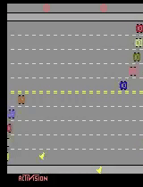

# 🧠 Robot Brain: Vision-Based Decision Making with PPO

**Building in public / learning in public 🚧**

This project explores how an agent can learn to **perceive and act from raw visual input** using reinforcement learning.  
A CNN-based policy is trained with **Proximal Policy Optimization (PPO)** to navigate a dynamic environment directly from pixel observations—without any hand-coded rules.

Although the environment is simple, the architecture mirrors real robotic systems:
**perception → decision-making → action**.

---

## 🎥 Demo (Learned Behavior)

The video below shows the trained agent navigating the environment after learning purely through interaction.

> 🐔 The environment is single-agent: only one bird is controlled by the policy.  
> Other moving objects are part of the environment dynamics.

  

---

## 🧩 Architecture Overview
Visual Observation (Pixels)
↓
CNN-Based Perception
↓
Policy Network (PPO)
↓
Action Selection

This loop represents the core of many robotics and autonomous systems, abstracted here into a lightweight simulation.

---

## 🔍 Technical Details

- **Algorithm:** Proximal Policy Optimization (PPO)
- **Policy:** CNN-based (`CnnPolicy`)
- **Environment:** `ALE/Freeway-v5` (Gymnasium, Atari)
- **Observations:** Raw pixel frames with Atari preprocessing
- **Training:** 500K timesteps in simulation
- **Frameworks:** Gymnasium, Stable-Baselines3, PyTorch

---

## 🚀 Results

- The agent learns timing and obstacle-aware navigation
- Behavior emerges purely from reward-driven learning
- No heuristics or rule-based logic are used

---

## 🛠️ Future Work

- Explicit world-state modeling
- Modular robot-brain architecture
- Language-based task reasoning
- Multi-agent extensions
- Transfer to robotics-inspired environments

---

## 📌 Notes

This repository is part of a **learning in public / building in public** journey focused on understanding how modern robot brains are designed—starting from perception and progressively moving toward reasoning and control.

---

